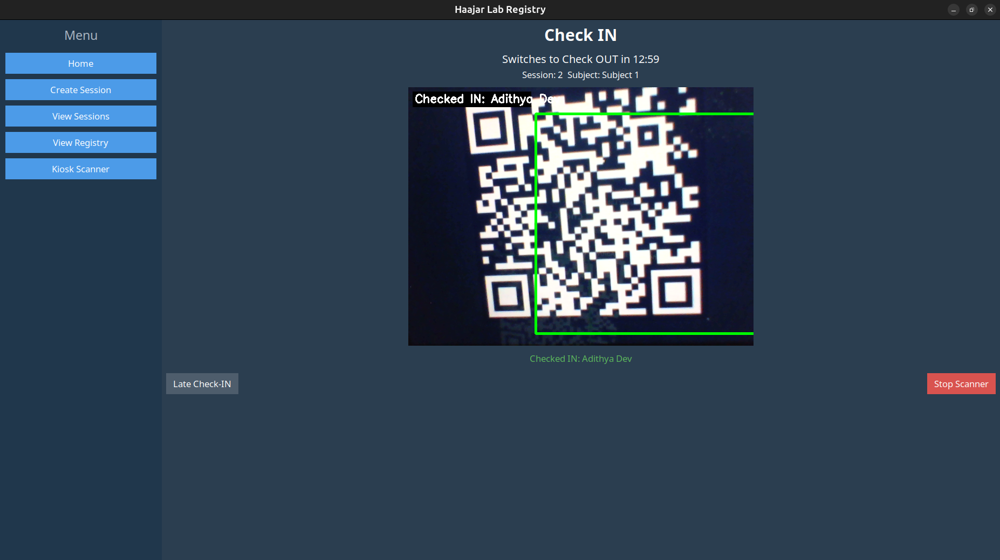
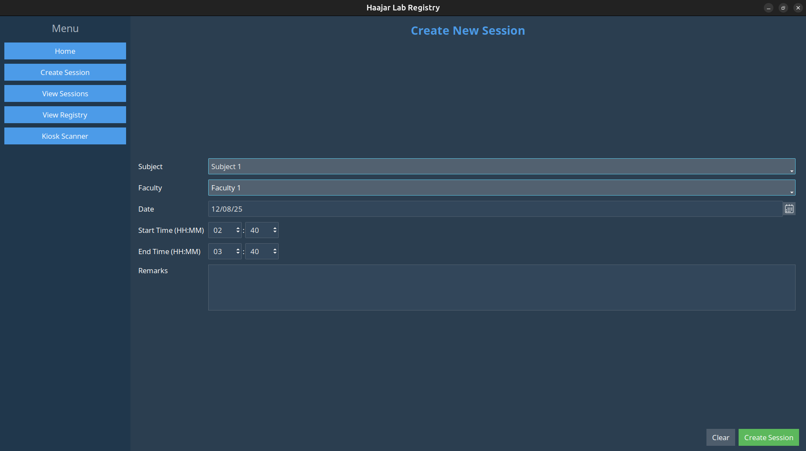
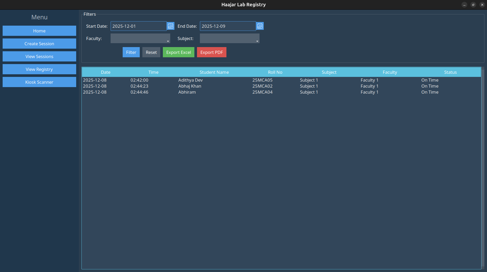

# Haajar Itto – Lab Attendance Registry System

A centralized, kiosk-based attendance system for computer labs that eliminates proxy attendance and links student presence to faculty-defined sessions.

## Problem Statement

Traditional lab attendance systems rely on manual registers or basic login methods.
These approaches are time-consuming, error-prone, and allow proxy attendance.
They also fail to link attendance records to specific subjects, faculty, and lab hours, making auditing difficult.

## Solution Overview

Haajar Itto is a desktop-based kiosk application where:
- Faculty create and control lab sessions
- Students check in and check out using QR/Barcode scanning
- Attendance is recorded with full session context (subject, faculty, time)

The system is designed to work with existing hardware and does not require expensive biometric devices.

## Key Features

- Faculty-controlled session creation (subject, date, time)
- QR/Barcode-based student check-in and check-out
- Automatic switch between check-in and check-out windows
- Late check-in handling with reason capture
- Real-time attendance logging

## System Workflow

1. Faculty logs in and creates a lab session
2. The system enters kiosk mode at the lab entrance
3. Students scan their ID cards to mark check-in
4. After the check-in window closes, the system switches to check-out mode
5. Faculty can view and export attendance reports from the registry

## Tech Stack

- Language: Python
- GUI: Tkinter, ttkbootstrap
- Database: SQL (SQLite / PostgreSQL compatible)
- ORM: SQLAlchemy
- Computer Vision: OpenCV
- QR/Barcode Scanning: pyzbar
- Reporting: Pandas, ReportLab

## Screenshots

### Kiosk Scanner


### Session Creation


### Attendance Registry



## Installation & Setup

1. Clone the repository
   ```bash
   git clone https://github.com/abhajkhan/haajar-app.git
   cd haajar-app
   ```
2. Create a virtual environment
   ```bash
   python -m venv venv
   source venv/bin/activate
   ```
3. Install dependencies
   ```bash
   pip install -r requirements.txt
   ```
4. Run the application
   ```bash
   python app.py
   ```

## License

This project is developed for academic purposes.
